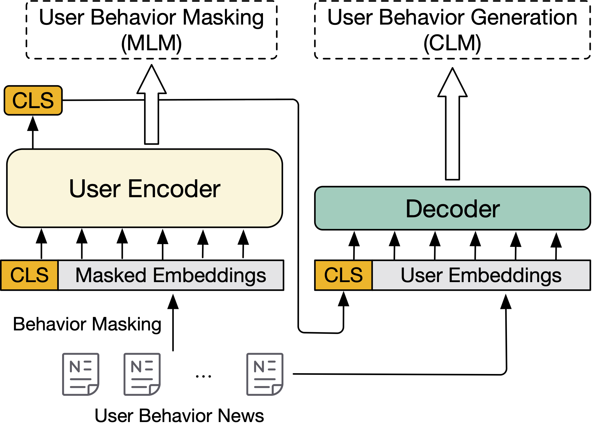

# PUNR: Pre-training with User Behavior Modeling for News Recommendation
Codebase for **[EMNLP 2023 Findings]** [PUNR: Pre-training with User Behavior Modeling for News Recommendation](https://arxiv.org/abs/2304.12633)

## Overview
In this work, we propose an unsupervised pre-training paradigm with two tasks for effective user behavior modeling.
1. User Behavior Masking: This task aims to recover the masked user behaviors based on their contextual behaviors.
2. User Behavior Generation: We further incorporate a novel auxiliary user behavior generation pre-training task to enhance the user representation vector derived from the user encoder.

<div  align="center">    
    
</div>


## Data processing
### [Optional] Auxiliary Decoder Initialization
Wiki + Bookcorpus, the same pre-training corpus of BERT, is used for initilized the auxiliary decoder in pre-training stage. Use following command to download and tokenize the corpus.

```bash
python pretrain/mkdata/download_make_wikibook.py \
    --save_to data/pretrain/wikibook.mlen512.s15.json \
    --n_proc 30
```

Set proper processor `n_proc` based on your environments. The download process needs internet access to Huggingface.

You can also ignore this step and use our initialized decoder layer in `assets/model.pt`. Please follow the pre-training section for detailed instructions.

### Pre-training Preprocess
MIND corpus is used for the pre-training. Download MIND collections from [here](https://msnews.github.io/) and unzip them into `data/` folder.

Then use following command to extract and tokenize the pre-training corpus.

```bash
python pretrain/mkdata/make_pretrain_data_multi_spans.py \
    --files data/MINDlarge_train/news.tsv \
    --behavior data/MINDlarge_train/behaviors.tsv \
    --save_to data/pretrain/mindlarge_user_title.multispans.json
```

### Fine-tuning Preprocess
Use the following commands to tokenize the fine-tuning corpus.

```bash
python mindft/mkdata/split_train_file.py data
python mindft/mkdata/split_dev_file.py data
```

Default to process MIND large
Change the `folder_name` in both scripts to `MINDsmall` for processing MIND small.


## Pre-training
### [Optional] Auxiliary Decoder Initialization
Use the following commands to initialize the auxiliary decoder.

```bash
torchrun pretrain/run_pretraining.py \
    --model_name_or_path bert-base-uncased \
    --output_dir $OUTPUT_DIR/model \
    --overwrite_output_dir \
    --dataloader_drop_last \
    --dataloader_num_workers 16 \
    --do_train \
    --logging_steps 200 \
    --save_strategy steps \
    --save_steps 20000 \
    --save_total_limit 5 \
    --fp16 \
    --logging_dir $TENSORBOARD_DIR \
    --report_to tensorboard \
    --optim adamw_torch_fused \
    --warmup_ratio 0.1 \
    --data_type anchor \
    --learning_rate 3e-4 \
    --max_steps 150000 \
    --per_device_train_batch_size 16 \
    --gradient_accumulation_steps 4 \
    --max_seq_length 512 \
    --weight_decay 0.01 \
    --freeze_bert \
    --disable_bert_mlm_loss \
    --bert_mask_ratio 0.30 \
    --use_dec_head \
    --n_dec_head_layers 1 \
    --enable_dec_head_loss \
    --dec_head_coef 1.0
```

We keep the global batch size to `512` for this initialization step. Only the decoder's parameters are updated during the initialization.

We also provided the initialized decoder in folder `assets/model.pt`. You can also ignore the above steps and directly use it by following options.

```bash
# Clone BERT-base to local folder
git lfs install
git clone https://huggingface.co/bert-base-uncased

# Copy `assets/model.pt` to BERT folder
cp assets/model.pt bert-base-uncased
```


### User Behavior Pre-training
To pre-train the encoder with User Behavior Masking and User Behavior Generation, please try the following commands.

```bash
torchrun pretrain/run_pretraining.py \
    --model_name_or_path $PATH/TO/BERT_w_decoder_head \
    --output_dir $OUTPUT_DIR/model \
    --overwrite_output_dir \
    --dataloader_drop_last \
    --dataloader_num_workers 8 \
    --do_train \
    --logging_steps 50 \
    --save_strategy steps \
    --save_steps 2000 \
    --save_total_limit 2 \
    --fp16 \
    --logging_dir $TENSORBOARD_DIR \
    --report_to tensorboard \
    --optim adamw_torch_fused \
    --warmup_ratio 0.1 \
    --data_type title \
    --sample_from_spans \
    --learning_rate 1e-5 \
    --max_steps 10000 \
    --per_device_train_batch_size 16 \
    --gradient_accumulation_steps 2 \
    --max_seq_length 512 \
    --train_path data/pretrain/mindlarge_user_title.multispans.json \
    --weight_decay 0.01 \
    --bert_mask_ratio 0.30 \
    --use_dec_head \
    --n_dec_head_layers 1 \
    --enable_dec_head_loss \
    --dec_head_coef 1.0 \
    --mask_whole_spans \
    --mask_whole_spans_token_ratio 0.3
```

We keep the total batch size to `256` in the pre-training setup.


### Fine-tuning and Testing
Use the following commands to fine-tune and test the pre-trained encoder.

```bash
MODEL_PATH=$OUTPUT_DIR/model
python mindft/run.py \
    --world_size 8 --n_gpu 8 --batch_size 16 \
    --model_name $MODEL_PATH \
    --config_name $MODEL_PATH \
    --tokenizer_name $MODEL_PATH \
    --model_dir $FINE_TUNED_DIR/model \
    --train_data_dir data/MINDlarge_train \
    --test_data_dir data/MINDlarge_dev \
    --use_linear_lr_scheduler True \
    --random_seed 42 \
    --epochs 3 \
    --lr 3e-5 \
    --mode train_test
```

You can choose to test MIND large / small by changing the `train_data_dir` and `test_data_dir` to `MINDsmall`.


## Performances
Pre-training with User Behavior Modeling gives effective user behavior modeling to the encoder. Performances on MIND benchmark is as follows.


MIND-Small

| Methods   | AUC   | MRR   | nDCG@5 | nDCG@10  |
|-----------|-------|-------|--------|----------|
| NRMS-BERT | 65.52 | 31    | 33.87  | 40.38    |
| PUNR      | 68.89 | 33.33 | 36.94  | 43.1     |

MIND-Large

| Methods   | AUC   | MRR   | nDCG@5 | nDCG@10  |
|-----------|-------|-------|--------|----------|
| NRMS-BERT | 69.5  | 34.75 | 37.99  | 43.72    |
| PUNR      | 71.03 | 35.17 | 39.04  | 45.4     |
